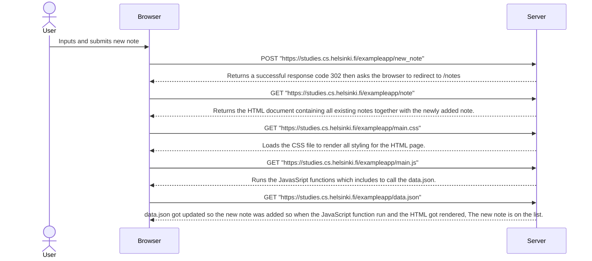

```mermaid
sequenceDiagram
    Actor User
    participant Browser
    participant Server

    User->>Browser: Inputs and submits new note
    Browser->>Server: POST "https://studies.cs.helsinki.fi/exampleapp/new_note"
    Server-->>Browser: Returns a successful response code 302 then asks the browser to redirect to /notes

    Browser->>Server: GET "https://studies.cs.helsinki.fi/exampleapp/note"
    Server-->>Browser: Returns the HTML document containing all existing notes together with the newly added note.

    Browser->>Server: GET "https://studies.cs.helsinki.fi/exampleapp/main.css"
    Server-->>Browser: Loads the CSS file to render all styling for the HTML page.

    Browser->>Server: GET "https://studies.cs.helsinki.fi/exampleapp/main.js"
    Server-->>Browser: Runs the JavasSript functions which includes to call the data.json.

    Browser->>Server: GET "https://studies.cs.helsinki.fi/exampleapp/data.json"
    Server-->>Browser: data.json got updated so the new note was added so when the JavaScript function run and the HTML got rendered, The new note is on the list.
```
