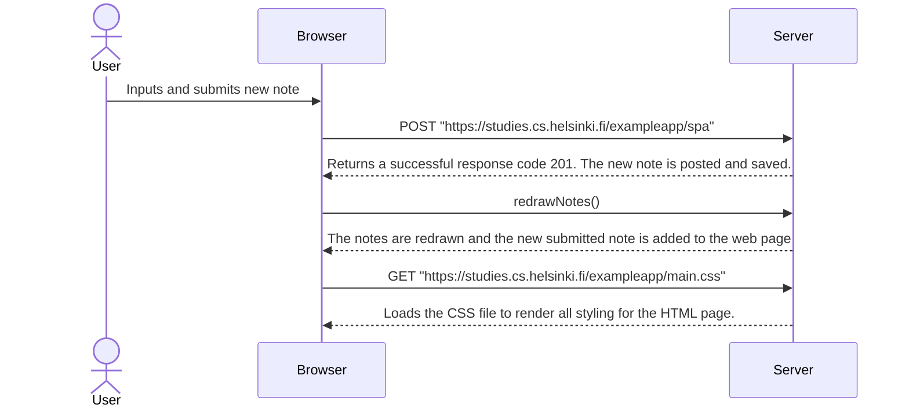

```mermaid
sequenceDiagram
    Actor User
    participant Browser
    participant Server

    User->>Browser: Inputs and submits new note
    Browser->>Server: POST "https://studies.cs.helsinki.fi/exampleapp/spa"
    Server-->>Browser: Returns a successful response code 201. The new note is posted and saved. 

    Browser->>Server: redrawNotes()
    Server-->>Browser: The notes are redrawn and the new submitted note is added to the web page

    Browser->>Server: GET "https://studies.cs.helsinki.fi/exampleapp/main.css"
    Server-->>Browser: Loads the CSS file to render all styling for the HTML page.
```
